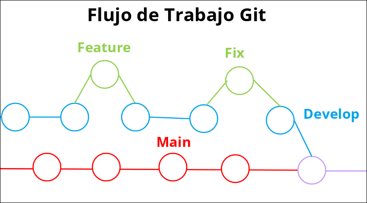
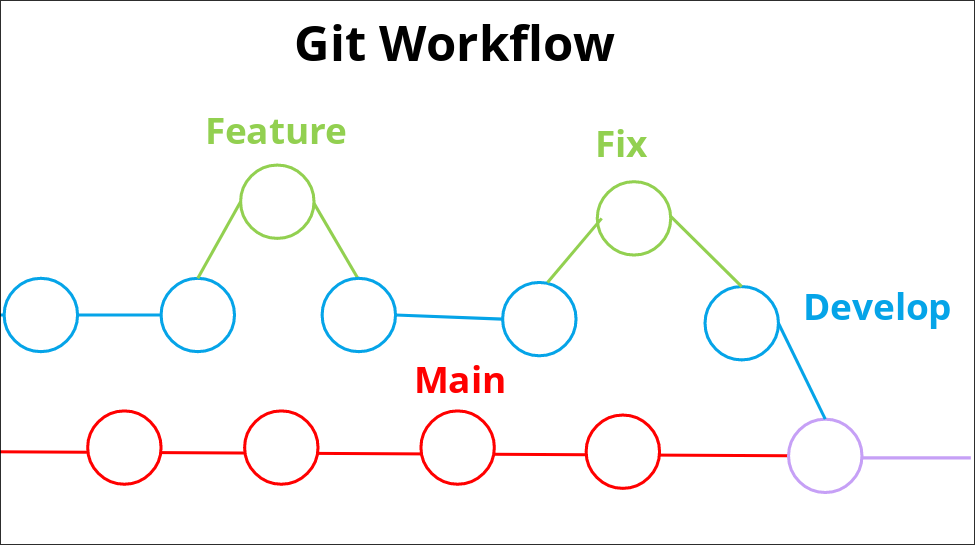

[Español](#nix-docs-español)
[Flujo de Trabajo Git](##flujo-de-trabajo-de-git)

[English](#nix-docs-english)
[Git Workflow](##git-workflow)

# Nix Docs Español

Nix Docs es un proyecto en busca de solventar la brecha de documentación que el ecosistema de Nix posee de una forma que sea fácil para los usuarios nuevos a la plataforma.

## Flujo de trabajo de Git

El flujo de trabajo del Git de Nix Docs tiene una forma definida, dicho flujo de trabajo consta de varias ramas que pueden estar clasificadas por 2 características especiales, la característica principal es el tiempo de vida de la rama, por lo tanto las dividimos en las ramas de larga vida útil y ramas de corta vida útil.

La segunda característica se identifica a la hora de subir código al repositorio, Las ramas de larga vida útil nunca van tener un commit directo, es decir nunca se va crear un archivo y desarrollarlo es las ramas de larga vida útil ademas de que dichas ramas nunca se van a eliminar, la única forma de que dichas ramas obtengan código es utilizando Merge.

### Ramas de Larga Vida Util

**main** Esta rama es la rama de producción, es decir esto es la que el cliente va ver y recibir. (Obtiene código a través del Merge con la rama develop)

**develop** Esta rama es la ultima etapa de pruebas antes de que el código pase a ser utilizado en producción.(Obtiene código a través de las ramas de corta vida útil)

**README** Esta rama es usada solo para manejar los archivos README del proyecto.

### Ramas de Corta Vida Útil

**feature** Esta rama va a contener las nuevas características que se van a añadir dentro del proyecto.

**update** Esta rama va a contener los cambios que requiera el proyecto.

**fix** Esta rama contiene la resolución de errores.

Estas ramas obtienen código a través del la edición o creación de nuevo archivos.

# Nix Docs English

Nix Docs is project focus in solving the big documentation gap that the Nix Ecosystem has in a beginner friendly way.

## Git Workflow

The Git Workflow of Nix Docs is defined in a special way, and has many different branches and can be sort by Long-Running branches and Short-Running branches the characteristics of the Long-Running branches only get new code using Merge and this branches never are delete.

### Long-Running Branches

**main** This branch is the production branch, it means that here will be the code that the client will see.(Only gets code through Merge with develop)

**develop** this branch is the last step before using the code in production and is use for testing.(Only gets code through Merge with the short-running branches)

**README** this branch is only use to manage the content of the README file inside the project.

### Short-Running Branches

**feature** this branch is going to contain the new features that will be implement in Nix Docs.

**update** this branch is use to implement the changes that are required in the project.

**fix** this branch contain bugs correction.

This branches get code through creating new files and updating existing files.
