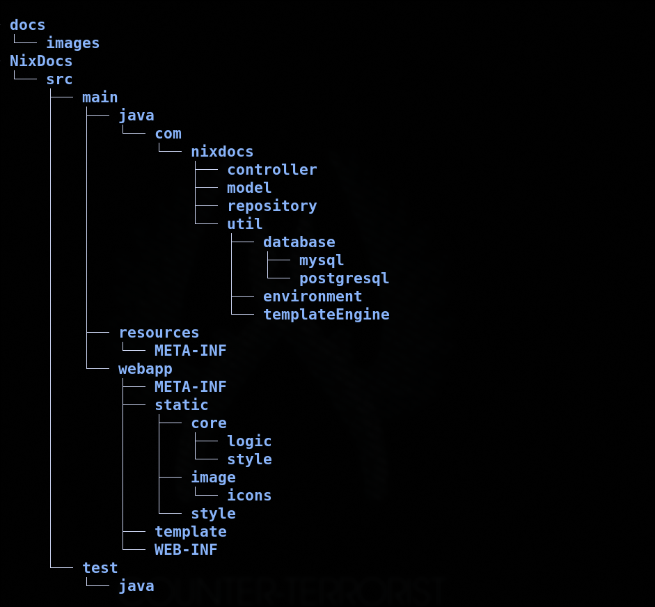

# Nix Docs English

Nix Docs is project focus in solving the big documentation gap that the Nix Ecosystem has in a beginner friendly way.

## Set Up 
### Prerequisites

- **Tomcat 11.0.11** 
- **JAVA/JDK/OPENJDK 21** 
- **PostgreSQL/MySQL** (based on your database configuration) 

### Installation 

1. **Clone the repository** 
```bash
git clone https://github.com/K1-mikaze/Nix-Docs
cd nix-docs
```

2. **Configure environment variables** 

You need to create a `.env` file next to your project `src` folder, with the database credentials like the following example: (Remember to add this file to your `.gitignore`)

```.env
DB_URL=jdbc:postgresql://localhost:5432/nixdocs
DB_URL=jdbc:mysql://localhost:5432/nixdocs
DB_USERNAME=your_username
DB_PASSWORD=your_password
```

3. **Build and deploy** 

- Configure your Tomcat server
- Run the application

## Project Structure

 

### Folder Structure

**controller**  Contains servlets that handle HTTP requests and coordinate between the view and model layers.

**model**  Houses classes representing data entities and the application's business logic.

**repository**  Implements the Repository pattern for data access, providing an abstraction layer over persistence.

**util/database**  Manages database connection configuration, connection pooling, and basic database operations.

**util/environment**  Provides utilities for environment variable management and application configuration.

**util/templateEngine**  Configures and manages the Thymeleaf template engine for view rendering.

**webapp/template**  Contains HTML templates with Thymeleaf syntax for application views.

**webapp/static**  Hosts static files such as CSS, JavaScript, TypeScript, images, and other frontend resources.

**docs**  Project documentation including README, installation guides, and technical documentation.

**test/java**  Suite of unit and integration tests to validate code functionality.


## Usage

### Application Routes

After starting the application, you can access the following endpoints:

| Page | URL |
|------|-----|
| Home | `http://localhost:8080/NixDocs` |
| Sign In | `http://localhost:8080/NixDocs/signin` |
| Sign Up | `http://localhost:8080/NixDocs/signup` |


## Git Workflow

The Git Workflow of Nix Docs is defined in a special way, and has many different branches that can be sorted into Long-Running branches and Short-Running branches. The characteristic of Long-Running branches is that they only get new code using Merge and these branches are never deleted.

### Long-Running Branches

**main** Production branch containing stable, client-facing code

- Only receives code via merge from develop

- Represents the current production state

**merge** Staging branch for final testing before production

- Receives code via merge from short-running branches

- Used for integration testing

### Short-Running Branches

**front-end** - This branch is specialized in the front-end: HTML, CSS, TypeScript, and JavaScript.

**back-end** - This branch is specialized in the back-end: Java, Servlet, and Databases connections.


---

# Nix Docs Español

Nix Docs es un proyecto enfocado en resolver la gran brecha de documentación que tiene el Ecosistema Nix de una manera amigable para principiantes.

## Configuracion 

### Prerequsitos

- **Tomcat 11.0.11** 
- **JAVA/JDK/OPENJDK 21** 
- **PostgreSQL/MySQL** (basado en la configuracion de tu base de datos) 

### Instalacion 

1. **Clona el repositorio** 
```bash
git clone https://github.com/K1-mikaze/Nix-Docs
cd nix-docs
```

2. **Configura las variables de enforno** 

You need to create a `.env` file next to your project `src` folder, with the database credentials like the following example:

Necesitas crear un archivo llamado **.env**  al lado del la carpeta `src` con las credenciales de tu base de datos como en este ejemplo: (Recuerda añadir este archivo a tu `.gitignore`) 

```.env
DB_URL=jdbc:postgresql://localhost:5432/nixdocs
DB_URL=jdbc:mysql://localhost:5432/nixdocs
DB_USERNAME=your_username
DB_PASSWORD=your_password
```

3. **Contruyelo y despliegalo** 

- Configura tu servidor Tomcat 

- Corre la Aplicacion

## Estructura del proyecto 

 

### Estructura de Carpetas

**controller**  Contiene los servlets que manejan las peticiones HTTP y coordinan entre la vista y el modelo.

**model**  Alberga las clases que representan las entidades de datos y la lógica de negocio de la aplicación.

**repository**  Implementa el patrón Repository para el acceso a datos, proporcionando una abstracción sobre la capa de persistencia.

**util/database**  Gestiona la configuración de conexión a la base de datos, pooling de conexiones y operaciones básicas de BD.

**util/environment**  Proporciona utilidades para la gestión de variables de entorno y configuración de la aplicación.

**util/templateEngine**  Configura y maneja el motor de plantillas Thymeleaf para el renderizado de vistas.

**webapp/template**  Contiene las plantillas HTML con sintaxis Thymeleaf para las vistas de la aplicación.

**webapp/static**  Aloja archivos estáticos como CSS, JavaScript, TypeScript, imágenes y otros recursos del frontend.

**docs**  Documentación del proyecto incluyendo README, guías de instalación y documentación técnica.

**test/java**  Suite de pruebas unitarias e integrales para validar el correcto funcionamiento del código.

## Uso

### Rutas Disponibles

Una vez que la aplicación esté en ejecución, puedes acceder a las siguientes rutas:

| Página | URL |
|--------|-----|
| Página Principal | `http://localhost:8080/NixDocs` |
| Inicio de Sesión | `http://localhost:8080/NixDocs/signin` |
| Registro de Usuario | `http://localhost:8080/NixDocs/signup` |

## Flujo de trabajo de Git

Nix Docs implementa un flujo de trabajo de Git particular, organizado en diferentes ramas que se categorizan como de Larga Duración y Corta Duración. Las ramas de Larga Duración se distinguen porque únicamente incorporan código mediante operaciones de Merge y nunca son eliminadas.

### Ramas de Larga Duración

**main** - Rama de producción que contiene código estable para el cliente

- Solo recibe código mediante merge desde develop
- Representa el estado actual de producción

**merge** - Rama de staging para pruebas finales antes de producción

- Recibe código mediante merge desde las ramas de corta duración
- Utilizada para pruebas de integración

### Ramas de Corta Duración

**front-end** - Esta rama está especializada en el front-end: HTML, CSS, TypeScript y JavaScript.

**back-end** - Esta rama está especializada en el back-end: Java, Servlet y conexiones a bases de datos.


